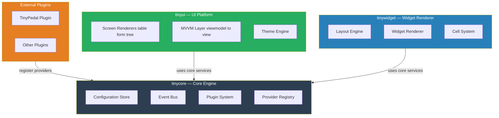

# TinyUi

A modular overlay based on [TinyPedal](https://github.com/TinyPedal/TinyPedal), the open-source racing overlay application.

While exploring how TinyPedal works internally, I noticed that the current architecture is very tightly coupled. Even small changes in one part of the codebase can have widespread effects across the project. This makes it difficult to extend or integrate new functionality without risking unintended side effects.

My original goal was to create an adapter layer that would allow TinyUI to plug into TinyPedal without modifying its core. However, due to the strong coupling between components, I couldn't find a clean or logical way to implement such an adapter.

Because of this, I decided to take a different approach: breaking apart some of TinyPedal’s internal assumptions and moving toward a more data-driven architecture.

Current Direction

The idea is to restructure how data flows through the system so that UI components depend on structured data rather than tightly bound application logic. By separating data sources, processing, and presentation, the overlay system becomes:

- more modular
- easier to extend
- safer to modify

# Current idea

This diagram illustrates a possible architectural direction, not a finalized design. Many aspects of the system are still undefined and may change as the project evolves.

To explore different approaches, I am experimenting with AI agents that iterate on the concept and help generate prototype implementations. The goal is to rapidly test ideas and identify which patterns work well in practice.

**This project is in early development. Things will break.**

## License

GPLv3 — see [LICENSE](LICENSE).

TinyUi builds on [TinyPedal](https://github.com/TinyPedal/TinyPedal) by s-victor, which is also licensed under GPLv3.
