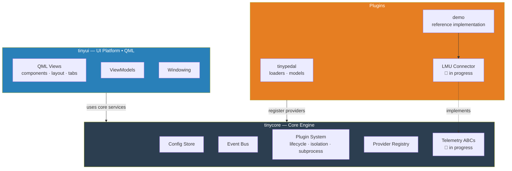

# TinyUi

---

## What is TinyUi?

TinyUi is a modular overlay toolkit for sim racing. The goal is a platform where you can connect to any supported game, build or install plugins, and display live telemetry data as overlays on your screen — without any of those pieces being tangled up with each other.

It started as an attempt to extend [TinyPedal](https://github.com/TinyPedal/TinyPedal). When that turned out to be impossible without rewriting the core, that became the project.

The architecture is split into three hard layers:

- **tinycore** — a generic engine with no domain knowledge. Plugin lifecycle, config store, event bus, provider registry.
- **plugins** — where game-specific code lives. A plugin connects to a game, reads telemetry, and exposes it through the provider API. Plugins run in isolated subprocesses.
- **tinyui** — the overlay UI, built in QML. Talks to tinycore, knows nothing about games.

Nothing is set in stone yet. The design evolves as the project does.

---

## Roadmap

### 0.1.0 — Foundation
The goal for 0.1 is a working foundation: the engine, the UI shell, and the first real game connector.

- [x] Plugin system — lifecycle, isolation, subprocess support
- [x] Data-driven config — TOML for plugin definitions, JSON for user data
- [x] QML overlay — windowing, theming, tab layout
- [x] Telemetry ABCs — abstract connector contract in tinycore
- [x] LMU connector — first real game connector (Le Mans Ultimate / rFactor 2)

### 0.2.0 — Widget renderer
Once the foundation is solid, the focus shifts to actually rendering data on screen.

- [ ] Widget system — define and render overlay widgets from plugin data
- [ ] Layout engine — position, resize, and stack widgets on screen
- [ ] Widget config — per-widget settings via the data-driven config system

### Later
Ideas that are on the radar but not scheduled yet:

- Reimplement Hotkey
- Reimplement processing of data (modules, plugin layer?) 
- Spotter?

---

## Architecture

---

## Plugin model

Plugins are self-contained packages. A minimal plugin needs:

- `plugin.py` — implements the `Plugin` protocol (`register`, `start`, `stop`)
- `editors.toml` — declarative config UI definition
- Default dicts — user config is auto-generated on first boot

The `demo` plugin is the reference implementation and stays in sync with the current plugin API.

---

## Help Wanted: TinyUi Logo

Looking for a community-contributed logo for **TinyUi**!

- Clean and recognizable at small sizes (32×32 up to 256×256)
- Fits the vibe of a lightweight overlay tool
- "Ui" or "TinyUi" in some form is a plus, not required

Open an issue with `[logo-proposal]` and share your design. All submissions welcome — rough concepts, SVGs, PNGs, anything. Contributors get credited. ⭐

Submitted logos are released under [CC BY-SA 4.0](https://creativecommons.org/licenses/by-sa/4.0/).

---

## Credits

Built on top of ideas and data models from [TinyPedal](https://github.com/TinyPedal/TinyPedal) by s-victor.

---

## AI use

This project was developed with AI assistance to move fast from idea to MVP as a one-person team. The code is curated and adjusted where needed — AI is a tool, not the author.

---

## License

GPLv3 — see [LICENSE](LICENSE).
