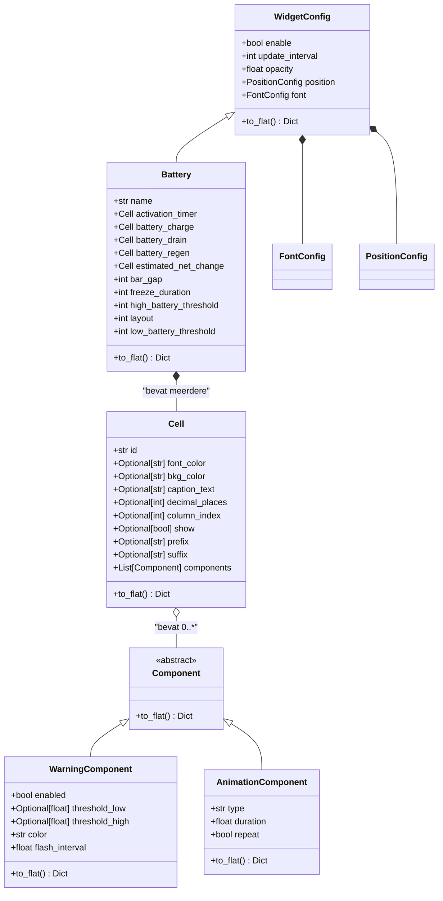

```mermaid
classDiagram
    class Component {
        <<abstract>>
        +to_flat() Dict
    }
    class WarningComponent {
        +bool enabled
        +Optional[float] threshold_low
        +Optional[float] threshold_high
        +str color
        +float flash_interval
        +to_flat() Dict
    }
    class AnimationComponent {
        +str type
        +float duration
        +bool repeat
        +to_flat() Dict
    }
    class Cell {
        +str id
        +Optional[str] font_color
        +Optional[str] bkg_color
        +Optional[str] caption_text
        +Optional[int] decimal_places
        +Optional[int] column_index
        +Optional[bool] show
        +Optional[str] prefix
        +Optional[str] suffix
        +List[Component] components
        +to_flat() Dict
    }
    class WidgetConfig {
        +bool enable
        +int update_interval
        +float opacity
        +PositionConfig position
        +FontConfig font
        +to_flat() Dict
    }
    class Battery {
        +str name
        +Cell activation_timer
        +Cell battery_charge
        +Cell battery_drain
        +Cell battery_regen
        +Cell estimated_net_change
        +int bar_gap
        +int freeze_duration
        +int high_battery_threshold
        +int layout
        +int low_battery_threshold
        +to_flat() Dict
    }
    
    Component <|-- WarningComponent
    Component <|-- AnimationComponent
    Cell o-- Component : "bevat 0..*"
    WidgetConfig <|-- Battery
    WidgetConfig *-- FontConfig
    WidgetConfig *-- PositionConfig
    Battery *-- Cell : "bevat meerdere"
```
