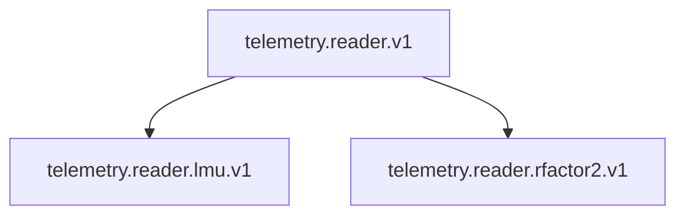
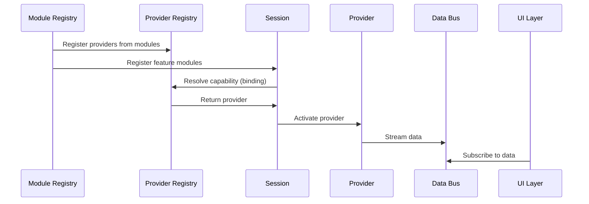

# TinyUI Modular Architecture Proposal (V2)

This document outlines a refined plugin architecture for TinyUI focused on **clear separation of concerns**, **capability-based composition**, and **runtime flexibility**.

The goal is to decouple:

* UI (widgets, overlays)
* Data acquisition (connectors/providers)
* Feature logic

---

# 1. Core Idea

The system moves from:

> “Plugins define everything (UI + data + logic)”

to:

> “Modules declare capabilities and are composed at runtime via binding”

---

# 2. Key Concepts

## 2.1 Module

A **Module** is the new top-level unit (previously “plugin”).

There are two primary module types:

| Type                 | Responsibility                     |
| -------------------- | ---------------------------------- |
| **Connector Module** | Provides data (via providers)      |
| **Feature Module**   | Consumes data and defines UI/logic |

---

## 2.2 Capability

A **Capability** is a **versioned contract** that defines *what kind of data or behavior is available*.

It is identified using a structured ID:

```text
<domain>.<category>[.<subtype>].v<version>
```

### Examples

```text
telemetry.reader.v1
telemetry.session.v1
telemetry.reader.lmu.v1
system.clock.v1
```

### Key Properties

* Abstract (no implementation details)
* Versioned (breaking changes create new versions)
* Stable (used across modules)

---

## 2.3 Provider

A **Provider** is a concrete implementation of one or more capabilities.

Example:

* LMU telemetry connector → provides:

  * `telemetry.reader.v1`
  * `telemetry.reader.lmu.v1`

---

## 2.4 Binding

**Binding** is the runtime process of resolving:

> “Which provider satisfies a required capability?”

This replaces the current direct instantiation model.

---

## 2.5 Registries

| Registry              | Responsibility                          |
| --------------------- | --------------------------------------- |
| **Module Registry**   | Discovers and loads module manifests    |
| **Provider Registry** | Tracks providers and their capabilities |

---

## 2.6 Session

A **Session** represents the active runtime context:

* Active providers
* Active bindings
* Runtime state

This allows:

* switching connectors at runtime
* multi-provider setups (future)

---

## 2.7 Data Bus

A **Data Bus** sits between providers and consumers.

Responsibilities:

* Distribute data streams
* Decouple update rates
* Enable multiple subscribers

---

# 3. Module Definitions

## 3.1 Connector Module (Data Provider)

**Responsibility:** Provide capabilities via providers.

### Example

```toml
name = "lmu_connector"
type = "module.connector"

exports = [
  "telemetry.reader.v1",
  "telemetry.reader.lmu.v1"
]

[provider]
module = "plugins.lmu_connector.connector"
class  = "LMUProvider"
```

---

## 3.2 Feature Module (UI + Logic)

**Responsibility:** Consume capabilities and define UI/logic.

### Example

```toml
name = "fuel_display"
type = "module.feature"

dependecy = ["telemetry.reader.v1"]

[ui]
widgets = "widgets.toml"

[logic]
module = "plugins.fuel.logic"
class  = "FuelFeature"
```

---

# 4. Capability Taxonomy

Capabilities are organized into domains and layers.

## 4.1 Core Telemetry Capabilities

```text
telemetry.reader.v1      # live telemetry stream
telemetry.session.v1     # session metadata
telemetry.lap.v1         # lap information
telemetry.car.v1         # car state
```

## 4.2 Specialized Capabilities

```text
telemetry.reader.lmu.v1
telemetry.reader.rfactor2.v1
```

These extend or refine base capabilities.

---

## 4.3 Capability Hierarchy



Meaning:

* Specialized providers also satisfy the base capability

---

# 5. Runtime Flow

## 5.1 High-Level Flow



---

## 5.2 Data Flow Model

Instead of direct calls:

```text
Widget → Provider (pull)
```

We move to:

```text
Provider → Data Bus → Feature → Widget
```

### Benefits

* Reduced coupling
* Efficient updates
* Multiple consumers supported

---

# 6. Binding Rules

When multiple providers exist:

1. User selection (explicit)
2. Feature preference (`prefers`)
3. Provider priority
4. Fallback (first available)

---

# 7. Lifecycle

Providers follow a defined lifecycle:

```text
DISCOVERED → INITIALIZED → ACTIVE → FAILED → STOPPED
```

The system must handle:

* startup
* failure recovery
* switching providers

---

# 8. Benefits

## 8.1 Modularity

* Multiple features can reuse one provider
* Features are independent

## 8.2 Flexibility

* Swap connectors without changing UI
* Support multiple games

## 8.3 Clean Separation

* UI does not instantiate data sources
* Data and presentation are decoupled

## 8.4 Extensibility

* New capabilities can be added without breaking existing modules

---

# 9. Migration from V1

### Key Changes

| V1                       | V2                             |
| ------------------------ | ------------------------------ |
| Plugin                   | Module                         |
| Connector tied to plugin | Provider exports capabilities  |
| Widgets tied to plugin   | Widgets depend on capabilities |
| Direct instantiation     | Runtime binding                |
| No versioning            | Versioned capabilities         |

---

# 10. Open Questions / Areas for Iteration

These are intentionally left open for refinement:

* Capability granularity (how coarse/fine?)
* Data Bus implementation (event vs stream vs polling hybrid)
* IPC boundary for feature logic (subprocess design)
* Capability versioning strategy enforcement
* Provider prioritization and health monitoring

---

# 11. Summary

This architecture introduces a **capability-driven system** where:

* Modules declare **what they provide** and **what they require**
* Providers implement capabilities
* The system **binds them dynamically at runtime**
* Data flows through a **central bus**, not direct calls

This creates a flexible foundation for:

* multi-game support
* reusable UI components
* scalable plugin ecosystems
