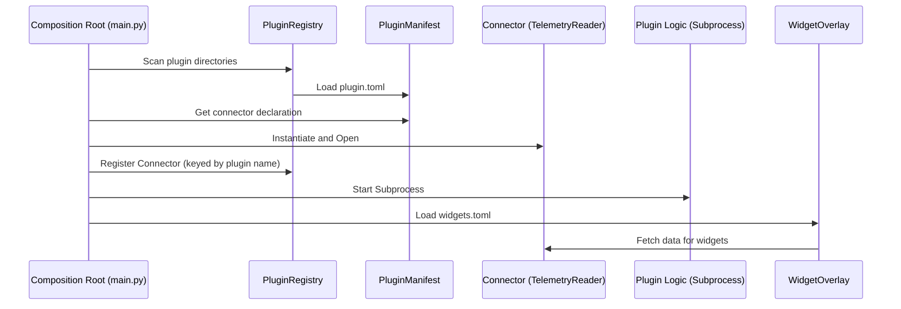
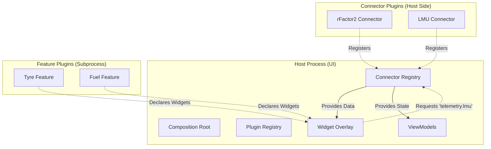

# TinyUI Modular Plugin Architecture Proposal

This document outlines a refactored architecture for TinyUI plugins to achieve better separation of concerns, decoupling the UI from data sources (connectors).

## Current State

Currently, a "Plugin" is a monolithic entity defined in a single `plugin.toml`. It bundles:
- Core logic (running in a subprocess).
- UI definitions (widgets and editors).
- Data source (the connector class running in the host).

The UI (Host) is responsible for instantiating the connector based on the plugin's manifest. This creates a tight coupling where a widget is often tied to a specific plugin's connector.

### Current Sequence Diagram



## Proposed Architecture: Decoupled Modules

We propose splitting the concept of a "Plugin" into two distinct types: **Connector Providers** and **Feature Plugins**.

### 1. Connector Provider (Data Plugin)
- **Responsibility:** Purely data acquisition from a specific game or API.
- **Implementation:** Implements the `TelemetryReader` (or a more generic `DataProvider`) interface.
- **Manifest:** Declares the data source type it provides (e.g., `telemetry.rfactor2`, `telemetry.lmu`).

### 2. Feature Plugin (UI/Logic Plugin)
- **Responsibility:** Defining how to display data (widgets) and any supporting logic.
- **Implementation:** Provides `widgets.toml`, `editors.toml`, and optional core logic.
- **Dependencies:** Declares what *types* of data providers it requires, rather than owning a specific one.

---

## The New Plugin Definition

### Connector Plugin (`plugins/lmu_connector/plugin.toml`)
```toml
name = "lmu_connector"
type = "connector"
provides = "telemetry.lmu"

[connector]
module = "plugins.lmu_connector.connector"
class  = "LMUConnector"
```

### Feature Plugin (`plugins/demo/plugin.toml`)
```toml
name = "demo"
type = "feature"
depends_on = ["telemetry.lmu"]

[logic]
module = "plugins.demo.plugin"
class  = "DemoPlugin"

[widgets]
file = "widgets.toml"
```

---

## Proposed Component Diagram



---

## Benefits

1.  **Modularity:** One connector (e.g., LMU) can serve multiple feature plugins (Tyre, Fuel, Timing) without those plugins needing to know about each other.
2.  **Flexibility:** Users can mix and match connectors and UI features. A "Generic HUD" plugin could work with *any* connector that provides the standard `TelemetryReader` interface.
3.  **Clean Host:** The UI doesn't "build" connectors for plugins. It discovers available connectors and lets feature plugins request them by interface/type.
4.  **Simplified UI:** The UI becomes a true "wrapper" or "host" that just facilitates the connection between data providers and data consumers.

## Implementation Steps

1.  **Update `PluginManifest`:** Support the new `type`, `provides`, and `depends_on` fields.
2.  **Refactor `ConnectorRegistry`:** Instead of keying by `plugin_name`, key by the provided data type (e.g., `telemetry.reader`).
3.  **Update `WidgetOverlay`:** Allow widgets to specify which data source type they need. If multiple connectors provide the same type, the UI can allow the user to select the active one.
4.  **Extract Connectors:** Move the connector code out of the `demo` plugin into its own `lmu_connector` (or similar) directory.
5.  **Simplify `main.py`:** Use a discovery-based approach to initialize connectors and features based on their manifests.
