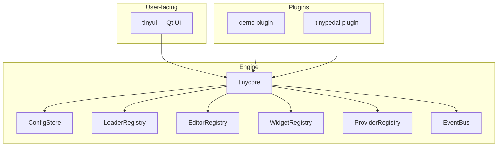
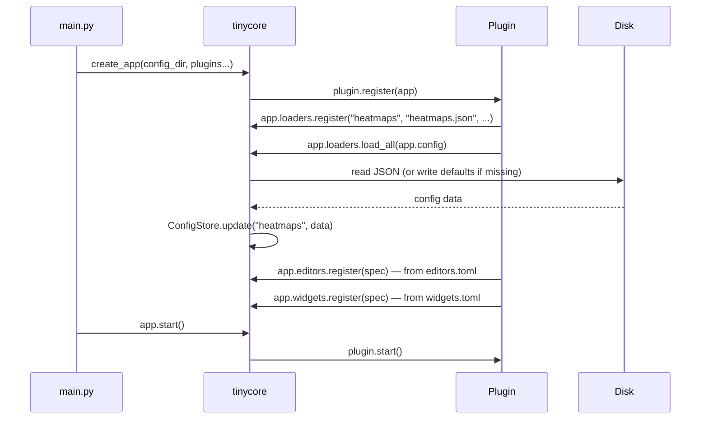
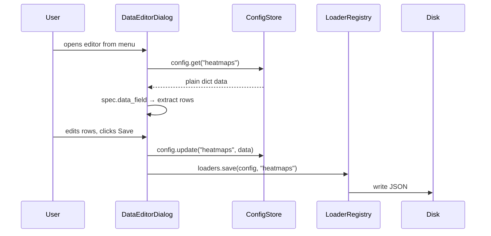
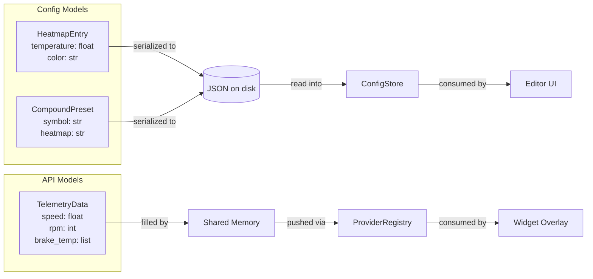
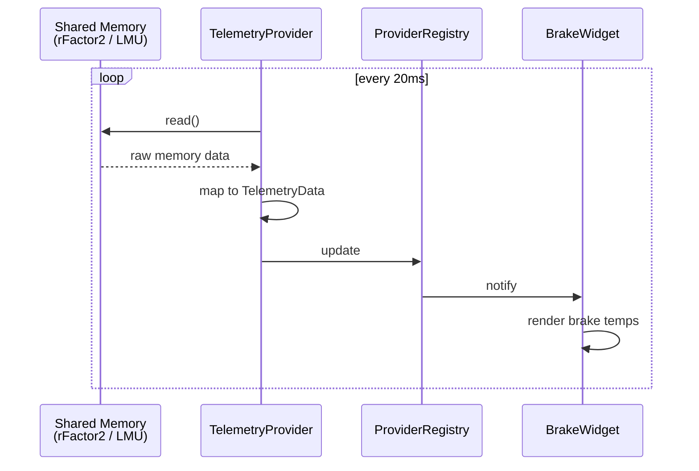
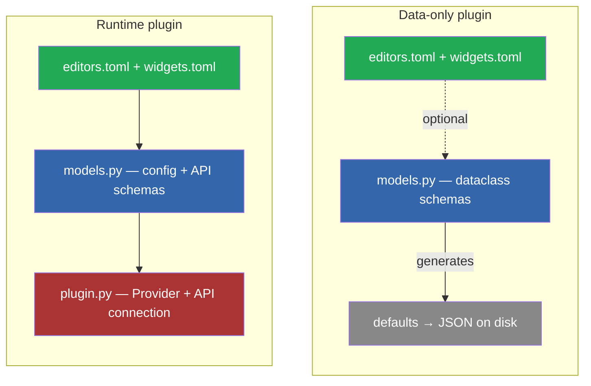

# Plugin Architecture

## Overview

TinyUI is a three-layer system: **tinycore** (engine), **plugins** (data + logic), **tinyui** (UI platform).

Plugins provide data, tinycore handles everything else.



## Current State

### Plugin file structure

```
src/plugins/demo/
├── plugin.py          # register(), start(), stop()
├── editors.toml       # editor definitions (columns, menu, data_field)
└── widgets.toml       # widget definitions (title, description, enable)

data/plugin-config/demo/
├── heatmaps.json      # user config (auto-generated from defaults)
└── compounds.json     # user config
```

### Boot sequence



### Data flow: editing



### What works well

- Fully data-driven: TOML for plugin definitions, JSON for user config
- No custom loaders, no serialization code
- Adding a plugin = dropping files, no changes to tinycore or tinyui

### What's missing

Config data is currently untyped — everything is `dict[str, Any]`:
- No IDE autocomplete on config fields
- No validation — a typo in a key only shows up at runtime
- No schema — you have to open the JSON to know which fields exist
- Widgets can't subscribe to typed data

---

## Next Step: Dataclasses as Schema

Dataclasses come back, but with a different role. They are the **schema**, not the storage.

### Two roles



**1. Config models** — define the shape of config data

```python
@dataclass
class HeatmapEntry:
    temperature: float = 0.0
    color: str = "#FFFFFF"

@dataclass
class CompoundPreset:
    symbol: str = "?"
    heatmap: str = "HEATMAP_DEFAULT_TYRE"
```

tinycore uses these to:
- Generate defaults from field defaults
- Validate JSON on load
- Derive editor columns (type, default, name) from fields

The JSON on disk stays the same. The dataclass is the schema, not the file.

**2. API models** — define the shape of telemetry/runtime data

```python
@dataclass
class TelemetryData:
    speed: float = 0.0
    rpm: int = 0
    gear: int = 0
    brake_temp: list[float] = field(default_factory=lambda: [0, 0, 0, 0])
    tyre_temp: list[float] = field(default_factory=lambda: [0, 0, 0, 0])
```

Providers fill these, widgets subscribe. The dataclass is the contract.

### What changes

| Component | Current | With dataclasses |
|-----------|---------|-----------------|
| Config in store | `dict[str, Any]` | `dict[str, HeatmapEntry]` |
| Validation | none | tinycore checks against dataclass fields |
| Editor columns | manual in `editors.toml` | derived from dataclass + TOML overrides |
| Defaults | Python dicts in plugin.py | dataclass field defaults |
| Telemetry | not implemented | `TelemetryData` via Provider + EventBus |

### What stays the same

- JSON for user config (dataclass ↔ JSON serialization handled by tinycore)
- TOML for editor/widget definitions (UI overrides: menu, data_field, title)
- Plugin structure (plugin.py, editors.toml, widgets.toml)
- Path ownership stays with tinycore

### Example: data-only plugin with dataclasses

```python
# plugins/demo/models.py

@dataclass
class HeatmapEntry:
    temperature: float = 0.0
    color: str = "#FFFFFF"

@dataclass
class CompoundPreset:
    symbol: str = "?"
    heatmap: str = "HEATMAP_DEFAULT_TYRE"
```

```python
# plugins/demo/plugin.py

class DemoPlugin:
    name = "demo"

    def register(self, app):
        # Register config types — tinycore derives defaults + schema
        app.config.register_model("heatmaps", HeatmapEntry)
        app.config.register_model("compounds", CompoundPreset)

        # editors.toml for UI overrides only
        app.editors.load(Path(__file__).parent / "editors.toml")
```

`editors.toml` becomes simpler — just UI overrides:

```toml
[heatmap]
title = "Heatmap Editor"
config = "heatmaps"
menu = "Demo"
data_field = "entries"
# columns derived from HeatmapEntry dataclass
```

### Example: runtime plugin with API



```python
# plugins/tinypedal/api.py

@dataclass
class TelemetryData:
    speed: float = 0.0
    rpm: int = 0
    gear: int = 0
    brake_temp: list[float] = field(default_factory=lambda: [0, 0, 0, 0])

class TelemetryProvider:
    """Reads shared memory, delivers TelemetryData."""

    def __init__(self):
        self._shm = None  # pyLMUSharedMemory

    def start(self):
        self._shm = connect_shared_memory()

    def get(self) -> TelemetryData:
        raw = self._shm.read()
        return TelemetryData(
            speed=raw.speed,
            rpm=raw.rpm,
            gear=raw.gear,
            brake_temp=list(raw.brake_temp),
        )
```

```python
# plugins/tinypedal/plugin.py

class TinyPedalPlugin:
    name = "tinypedal"

    def register(self, app):
        self._telemetry = TelemetryProvider()
        app.providers.register("telemetry", self._telemetry)
        app.editors.load(Path(__file__).parent / "editors.toml")

    def start(self):
        self._telemetry.start()

    def stop(self):
        self._telemetry.stop()
```

Widget consuming data:

```python
class BrakeWidget:
    def update(self):
        data = self.app.providers.get("telemetry")
        self.set_temps(data.brake_temp)  # typed, autocomplete works
```

---

## Plugin Types Summary



- **Data-only plugins**: TOML + JSON, optionally dataclasses for schema
- **Runtime plugins**: dataclasses + minimal Python for API connection
- **tinycore**: handles serialization, validation, path management, event distribution
- **Dataclasses are the contract** — they describe the shape of data, not how it's stored
