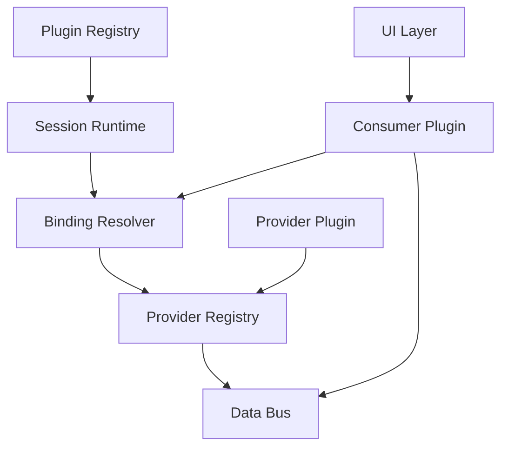
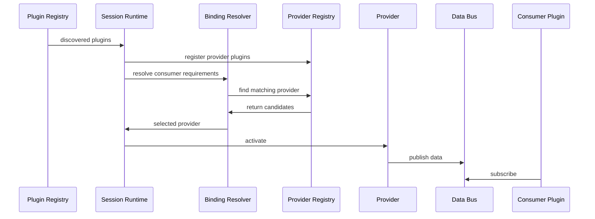

# TinyUI Runtime Architecture

This document defines the target runtime architecture for TinyUI.

It is written against the current codebase, but it describes the system we want to build next rather than telling a migration story. The goal is to make the current structure visible, show where the gaps are, and define a cleaner runtime model.

This document focuses on:

* runtime composition
* manifest structure
* capability binding
* provider and consumer responsibilities
* UI data access contracts

---

# 1. Design Intent

TinyUI should become a runtime where independently packaged plugins can be composed without hard-wiring one plugin to one connector or one widget set to one data source.

The system should allow:

* one data provider to serve multiple UI plugins
* UI plugins to depend on declared capabilities rather than plugin names
* runtime binding between requested capabilities and available providers
* a host that composes plugins instead of manually wiring plugin-specific behavior

---

# 2. Current Codebase Map

The current repository already contains several parts of a plugin runtime, but they do not yet form one consistent system.

## 2.1 Composition Root

The current composition root lives in:

* `src/app/main.py`

It currently performs all of these jobs directly:

* discover plugin manifests
* create subprocess plugins
* start the core runtime
* instantiate host-side connectors
* register connectors under plugin names
* load widget TOML files directly from manifests
* build the overlay and connect it to those connectors

In practice, that means the composition root is still carrying too much architectural policy.

---

## 2.2 Plugin Runtime Primitives

The current plugin runtime lives mostly in:

* `src/tinycore/plugin/`

Important parts:

* `protocol.py` defines the plugin lifecycle shape
* `registry.py` stores plugins and coordinates register/start/stop
* `context.py` exposes a scoped plugin context
* `runner.py` defines the subprocess protocol
* `subprocess_host.py` hosts subprocess plugins in the main runtime
* `lifecycle.py` manages on-demand activation and delayed shutdown

This is already a useful base for an isolated plugin runtime.

---

## 2.3 Telemetry Connector Runtime

Telemetry-specific runtime pieces live in:

* `src/tinycore/telemetry/reader.py`
* `src/tinycore/telemetry/registry.py`

Important characteristics:

* the connector contract is rich and domain-specific
* connectors are keyed by plugin name
* widgets currently access data through those plugin-bound connectors

This is functional, but too tightly coupled for the target architecture.

---

## 2.4 Generic Provider Runtime

A more generic provider concept already exists in:

* `src/tinycore/providers/protocol.py`
* `src/tinycore/providers/registry.py`

This is important because it points toward the architecture we actually want:

* providers are not tied to plugin names
* lookup is based on the thing being provided

The current version is still small and type-keyed, but it is closer to the target direction than the connector registry.

---

## 2.5 Widget Runtime

The widget runtime lives in:

* `src/tinywidgets/spec.py`
* `src/tinywidgets/overlay.py`
* `src/tinywidgets/runner.py`

Important characteristics:

* widgets are loaded per plugin
* each widget declares a `source` path
* runners resolve that path directly against a connector
* runners choose a connector via `plugin_name`

This is the main coupling point between UI declarations and data source ownership.

---

# 3. Existing Building Blocks Worth Keeping

The new architecture does not need a full reset.

The following pieces are already aligned with the direction we want:

## 3.1 Isolated Plugin Execution

The subprocess model is already useful:

* plugins can run outside the host process
* host and plugin communicate through an explicit protocol
* lifecycle is already formalized

This is a strong base for runtime composition.

---

## 3.2 Scoped Plugin Context

`PluginContext` already gives plugins controlled access to shared infrastructure instead of the entire app container.

That is a good foundation for:

* plugin isolation
* future capability APIs
* reducing accidental coupling

---

## 3.3 Provider Registry Direction

The generic provider registry shows the right design instinct:

* register what is available
* resolve by requested contract

It should likely evolve rather than be removed.

---

## 3.4 Event Bus

The event bus in `src/tinycore/events/bus.py` is simple, but it may still remain useful for:

* host lifecycle events
* runtime state changes
* provider health updates
* UI notifications

It should not replace data binding, but it may complement it.

---

# 4. Architectural Problems To Solve

The next version of the runtime should solve these problems explicitly.

## 4.1 Plugin-Name Coupling

Today, data access is effectively shaped like:

```text
widget -> plugin_name -> connector -> source path
```

That means UI declarations are indirectly tied to plugin ownership.

The new system must replace plugin-name lookup with capability-based binding.

---

## 4.2 Composition Root Owns Too Much Policy

The host currently decides:

* how connectors are created
* how widgets are discovered
* how widget data is resolved
* when plugins are activated

The new system should move these policies into explicit runtime components instead of leaving them embedded in `main.py`.

---

## 4.3 Manifest Shape Is Too Narrow

The current manifest structure still assumes a mostly monolithic plugin layout:

* one plugin class
* optional connector
* optional mock connector
* optional widgets file

The new system needs manifests that describe:

* plugin role
* exported capabilities
* declared requirements
* runtime contributions

---

## 4.4 UI Is Bound To Connector Internals

The current widget model depends on direct dot-path traversal into connector readers.

That creates two issues:

* UI depends on internal reader shape
* connector implementations define the UI data contract implicitly

The new system needs an explicit UI-facing data contract.

---

## 4.5 Generic Provider System And Telemetry System Are Split

There are currently two parallel ideas:

* telemetry connectors keyed by plugin name
* generic providers keyed by type

The new runtime should converge these into one composition model.

---

# 5. Naming Model

This section defines the terms used in the rest of the document.

## 5.1 Plugin

A **Plugin** is the top-level discovered unit described by `plugin.toml`.

We keep this term because it matches the packaging and discovery model of the project.

---

## 5.2 Provider Plugin

A **Provider Plugin** exports one or more capabilities.

Its responsibility is to make something available to the runtime.

Examples:

* telemetry source
* clock source
* session metadata source

---

## 5.3 Consumer Plugin

A **Consumer Plugin** declares required capabilities and uses them to provide UI, logic, or interaction behavior.

Its responsibility is to consume runtime services, not own the source.

Examples:

* fuel display
* tyre display
* timing overlay

---

## 5.4 Capability

A **Capability** is a versioned runtime contract.

It defines what kind of data or behavior is available without naming the implementation.

Format:

```text
<domain>.<kind>[.<specialization>].v<version>
```

Examples:

```text
telemetry.reader.v1
telemetry.reader.lmu.v1
telemetry.session.v1
ui.overlay-data.v1
```

---

## 5.5 Provider

A **Provider** is the runtime implementation object that satisfies one or more capabilities.

The plugin is the package. The provider is the active runtime object.

---

## 5.6 Binding

**Binding** is the runtime process of resolving which provider satisfies a requested capability.

---

## 5.7 Session

A **Session** is the active composed runtime state.

It owns:

* active plugins
* active providers
* resolved bindings
* runtime health and status

---

## 5.8 Data Bus

A **Data Bus** is the runtime channel through which provider output is distributed to consumers.

It exists to prevent direct provider-to-widget coupling.

---

# 6. Target Runtime Model

The target runtime should be built around capability-driven composition.

## 6.1 High-Level Shape



Runtime intent:

* plugins are discovered from manifests
* provider plugins register providers and exported capabilities
* consumer plugins declare `requires`
* the session resolves bindings
* providers publish through the data bus
* consumer plugins and UI subscribe through stable contracts

---

## 6.2 Runtime Responsibilities

### Plugin Registry

Responsible for:

* discovering manifests
* validating manifest shape
* classifying plugins by role
* exposing plugin metadata to the session

### Provider Registry

Responsible for:

* registering provider instances
* indexing exported capabilities
* exposing candidates for binding

### Binding Resolver

Responsible for:

* finding providers for requested capabilities
* applying selection rules
* recording active bindings in the session

### Session Runtime

Responsible for:

* starting and stopping active providers
* managing binding state
* tracking provider health
* coordinating runtime switching

### Data Bus

Responsible for:

* publishing provider output
* distributing data to multiple consumers
* decoupling producer and consumer timing

---

# 7. Manifest Model

The new architecture needs manifests that describe runtime intent instead of a narrow plugin layout.

## 7.1 Shared Fields

Every plugin manifest should define at least:

```toml
name = "fuel_display"
type = "plugin.consumer"
version = "0.1.0"
```

Additional metadata can be added later, but those three define identity and role.

---

## 7.2 Provider Plugin Manifest

Example:

```toml
name = "lmu_provider"
type = "plugin.provider"
version = "0.1.0"

exports = [
  "telemetry.reader.v1",
  "telemetry.reader.lmu.v1"
]

[provider]
module = "plugins.lmu_provider.provider"
class  = "LMUProvider"
```

Semantics:

* `exports` declares runtime contracts
* `[provider]` identifies the runtime implementation

---

## 7.3 Consumer Plugin Manifest

Example:

```toml
name = "fuel_display"
type = "plugin.consumer"
version = "0.1.0"

requires = [
  "telemetry.reader.v1",
  "ui.overlay-data.v1"
]

[ui]
widgets = "widgets.toml"

[logic]
module = "plugins.fuel_display.logic"
class  = "FuelDisplayPlugin"
```

Semantics:

* `requires` declares what must be bound
* `[ui]` declares UI assets or specs
* `[logic]` declares optional plugin logic

---

# 8. Capability Model

Capabilities should become the main contract language of the runtime.

## 8.1 Rules

A capability should be:

* stable
* explicit
* versioned
* implementation-agnostic

---

## 8.2 General And Specialized Capabilities

Example set:

```text
telemetry.reader.v1
telemetry.session.v1
telemetry.vehicle.v1
telemetry.reader.lmu.v1
telemetry.reader.rfactor2.v1
ui.overlay-data.v1
```

General capabilities represent portable contracts.

Specialized capabilities represent implementation-specific extensions.

---

## 8.3 Capability Preference

Consumer plugins should require the most general capability they truly need.

Examples:

* if a widget only needs generic fuel state, depend on `telemetry.vehicle.v1`
* if a plugin needs LMU-specific behavior, depend on `telemetry.reader.lmu.v1`

This keeps consumers portable when possible.

---

# 9. Binding Model

Binding is the core runtime operation in the new system.

## 9.1 Resolution Flow



---

## 9.2 Selection Rules

If multiple providers satisfy the same capability, resolution should be deterministic.

Suggested order:

1. explicit user selection
2. consumer preference
3. provider priority
4. first healthy fallback

These rules should live in the binding resolver or session runtime, not in individual widgets.

---

# 10. UI Data Contract Model

This is one of the most important design points in the system.

The current widget model uses source paths like:

```text
vehicle.fuel
```

resolved directly against connector internals.

That approach should be replaced by an explicit UI-facing contract.

## 10.1 Design Goal

Widgets should declare what data they need in a runtime-stable way that does not depend on:

* plugin names
* connector class names
* connector object graph layout

---

## 10.2 Direction

Instead of:

```text
plugin = demo
source = vehicle.fuel
```

the target system should move toward something like:

```toml
capability = "telemetry.vehicle.v1"
field = "fuel"
```

or a similarly explicit capability-and-field contract.

The exact field schema still needs design, but the architectural rule should be clear:

* UI contracts must be declared against capabilities, not connector internals

---

## 10.3 Role Of Consumer Plugins

A consumer plugin can translate raw capability data into UI-oriented output.

That means the final runtime shape can become:

```text
Provider -> Data Bus -> Consumer Plugin -> Widget
```

rather than:

```text
Widget -> Connector
```

This gives TinyUI a place to hold:

* formatting logic
* derived values
* visibility rules
* state shaping for UI

without making widgets responsible for connector traversal.

---

# 11. Provider Lifecycle

Providers should follow a clear lifecycle managed by the session.

Suggested states:

```text
DISCOVERED -> INITIALIZED -> ACTIVE -> FAILED -> STOPPED
```

The session should be able to handle:

* startup
* shutdown
* provider failure
* reconnect
* runtime provider switching

---

# 12. Implementation Tracks

This should be built in clear tracks rather than as one giant refactor.

## Track 1: Manifest And Discovery Layer

Build:

* new manifest schema
* manifest parser and validation
* plugin role classification

Outcome:

* the runtime can discover provider and consumer plugins as first-class roles

---

## Track 2: Session And Binding Runtime

Build:

* session runtime
* provider registration model
* capability-based binding
* provider lifecycle state

Outcome:

* the host no longer binds data by plugin name

---

## Track 3: UI Contract Layer

Build:

* widget-facing capability contract
* consumer plugin data shaping
* bus-driven UI data delivery

Outcome:

* widgets stop traversing connector internals directly

---

## Track 4: Composition Root Simplification

Build:

* runtime bootstrap using registries and session services
* smaller `main.py`
* explicit orchestration boundaries

Outcome:

* the architecture lives in runtime components, not in manual host wiring

---

# 13. Open Design Questions

These points still need explicit design decisions:

* Should provider lookup be string-capability keyed, type-keyed, or support both?
* What is the exact UI field contract format for widget specs?
* Should consumer plugins subscribe directly to the data bus, or bind through viewmodel-like adapters?
* How should specialized capabilities inherit from or satisfy general capabilities?
* How much of the existing telemetry reader interface remains public versus being adapted behind providers?
* Is `requires` enough on its own, or do we later add optional fields like `prefers` or `optional`?

---

# 14. Summary

TinyUI should move toward a runtime where:

* plugins are discovered as first-class runtime units
* provider plugins export versioned capabilities
* consumer plugins declare `requires` on those capabilities
* a session runtime resolves bindings dynamically
* providers publish through a data bus
* UI consumes explicit capability-based contracts instead of plugin-bound connector paths

The current codebase already contains several valuable building blocks for this system:

* subprocess plugin hosting
* scoped plugin context
* provider registry primitives
* event infrastructure

That gives us a solid base for setting concrete goals, runtime contracts, and implementation tracks.
