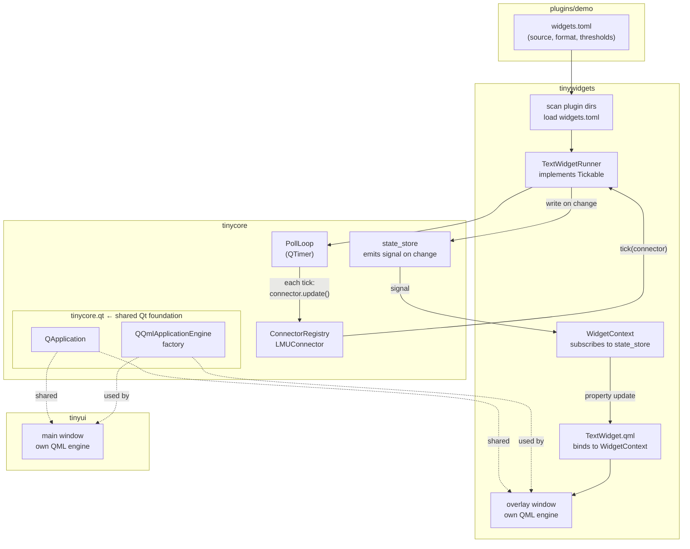

# TextWidget Design

The first generic widget for TinyUi. One component, driven entirely by config —
no Python code needed to add a new numeric overlay widget.

---

## Package structure

```
src/
├── tinycore/                   # generic engine + shared Qt foundation
│   ├── qt/                     # ← the ONLY Qt code in tinycore
│   │   ├── app.py              # QApplication lifecycle
│   │   └── engine.py           # QQmlApplicationEngine factory
│   ├── poll/
│   │   ├── loop.py             # PollLoop — owns the tick cycle
│   │   └── tickable.py         # Tickable protocol (pure Python)
│   └── ...existing files unchanged (pure Python)...
│
├── tinywidgets/                # self-contained: logic + QML + own overlay window
│   ├── __init__.py
│   ├── spec.py                 # WidgetSpec, load_widgets_toml
│   ├── registry.py             # WidgetRegistry
│   ├── paths.py                # telemetry path resolver
│   ├── threshold.py            # ThresholdEntry + evaluate()
│   ├── flash.py                # FlashState
│   ├── runner.py               # TextWidgetRunner, WidgetState
│   ├── context.py              # WidgetContext — subscribes to state_store, exposes to QML
│   ├── overlay.py              # transparent overlay window (own QQmlApplicationEngine)
│   └── qml/
│       └── TextWidget.qml
│
├── plugins/
│   └── demo/
│       └── widgets.toml        # extended with source/format/thresholds
│
└── tinyui/                     # application shell — main window + settings UI
    └── ...no widget code...
```

**Import rules — no spaghetti:**
- `tinycore` has no imports from `tinywidgets` or `tinyui`
- `tinycore.qt` is the only Qt-dependent code in tinycore — the rest is pure Python
- `tinywidgets` imports `tinycore.qt.engine` (engine factory) and `tinycore.poll.tickable`
- `tinyui` imports `tinycore.qt.app` (QApplication) and has no knowledge of `tinywidgets`
- `tinywidgets` and `tinyui` never import each other — both build on `tinycore.qt` independently

`tinycore/widget.py` (the old WidgetSpec/WidgetRegistry) is removed.
Plugins no longer register widgets via `ctx` — `widgets.toml` is enough.
`tinywidgets` scans plugin directories for `widgets.toml` at startup.

---

## Goal

A single `TextWidget` that can render any numeric telemetry value:
fuel level, battery charge, tyre temperature, RPM, brake wear, speed, etc.

Instead of writing a new Python class per widget (TinyPedal approach), the
widget is fully described in `widgets.toml`. Adding a new widget = adding a
TOML entry.

---

## What it does

- Reads one telemetry value from the active connector
- Formats it as a string (e.g. `"87.3°"`, `"42.1 L"`)
- Colors the background based on threshold breakpoints
- Optionally flashes the background when a warning threshold is crossed
- Displays an optional label next to the value
- Persists its screen position per user

---

## Widget TOML schema (`widgets.toml`)

```toml
[fuel]
title           = "Fuel"
description     = "Remaining fuel in liters"
type            = "value"         # base widget type

source          = "vehicle.fuel"  # telemetry path (see resolver table)
source_index    = null            # index into tuple results; null = scalar

format          = "{:.1f} L"     # Python format string
label           = "FUEL"
label_show      = true
update_interval = 100             # ms (default: 100)

# Threshold breakpoints — sorted ascending by `at`
# Picks the last entry where at <= value; falls back to first entry's color
[[fuel.thresholds]]
at    = 0.0
color = "#FF4444"   # critically low

[[fuel.thresholds]]
at    = 3.0
color = "#FFAA00"   # low warning

[[fuel.thresholds]]
at    = 8.0
color = "#CCCCCC"   # normal

# Flash (optional) — blinks when condition is met
[fuel.flash]
below    = 3.0   # flash when value < 3.0
interval = 0.4   # seconds per blink toggle
count    = 0     # 0 = indefinite; >0 = stop after N blinks
```

Tyre temperature example with fine-grained heatmap thresholds:

```toml
[tyre_temp_fl]
title        = "Tyre Temp FL"
type         = "value"
source       = "tyre.surface_temperature"
source_index = 0        # 0=FL 1=FR 2=RL 3=RR
format       = "{:.0f}°"
label        = "TFL"
label_show   = true

[[tyre_temp_fl.thresholds]]
at = 0.0;   color = "#4488FF"   # cold
[[tyre_temp_fl.thresholds]]
at = 70.0;  color = "#44BBFF"   # warming
[[tyre_temp_fl.thresholds]]
at = 85.0;  color = "#44FF44"   # optimal
[[tyre_temp_fl.thresholds]]
at = 100.0; color = "#FFAA00"   # hot
[[tyre_temp_fl.thresholds]]
at = 115.0; color = "#FF4444"   # overheating
```

---

## User config (JSON, per widget instance)

Plugin declares defaults in `widgets.toml`. User overrides live in
`data/widget-config/{plugin}/{widget_id}.json`:

```json
{
  "enabled": true,
  "x": 120,
  "y": 840,
  "thresholds": [
    { "at": 0.0, "color": "#FF4444" },
    { "at": 3.0, "color": "#FFAA00" },
    { "at": 8.0, "color": "#CCCCCC" }
  ]
}
```

Position (`x`, `y`) is always user-controlled, never in the plugin TOML.

---

## tinycore additions

### `tinycore/poll/tickable.py` — protocol

```python
from typing import Protocol
from tinycore.telemetry.reader import TelemetryReader

class Tickable(Protocol):
    def tick(self, connector: TelemetryReader) -> None: ...
```

Core knows nothing about widgets — only that some things want to be ticked.

### `tinycore/poll/loop.py` — poll loop

```python
class PollLoop:
    """Owns the update cycle. Started by tinyui, fed Tickables by tinywidgets."""

    def register(self, tickable: Tickable) -> None: ...
    def start(self, connector: TelemetryReader, interval_ms: int = 100) -> None: ...
    def stop(self) -> None: ...
```

Each tick: `connector.update()` once, then `tickable.tick(connector)` for each registered Tickable.

### State store

Core holds `dict[str, WidgetState]` — updated by runners each tick, read by
the ViewModel each frame. No signals needed between core and tinywidgets; the
ViewModel polls the store and emits Qt signals to QML.

---

## tinywidgets internals

### `paths.py` — telemetry path resolver

```python
from tinycore.telemetry.reader import TelemetryReader

_PATHS = {
    "vehicle.fuel":                  lambda r, i: r.vehicle.fuel(i),
    "vehicle.speed":                 lambda r, i: r.vehicle.speed(i),
    "engine.rpm":                    lambda r, i: r.engine.rpm(i),
    "engine.gear":                   lambda r, i: r.engine.gear(i),
    "engine.oil_temperature":        lambda r, i: r.engine.oil_temperature(i),
    "engine.water_temperature":      lambda r, i: r.engine.water_temperature(i),
    "tyre.surface_temperature":      lambda r, i: r.tyre.surface_temperature(i),
    "tyre.inner_temperature":        lambda r, i: r.tyre.inner_temperature(i),
    "tyre.pressure":                 lambda r, i: r.tyre.pressure(i),
    "tyre.wear":                     lambda r, i: r.tyre.wear(i),
    "brake.temperature":             lambda r, i: r.brake.temperature(i),
    "brake.wear":                    lambda r, i: r.brake.wear(i),
    "electric_motor.battery_charge": lambda r, i: r.electric_motor.battery_charge(i),
    "lap.progress":                  lambda r, i: r.lap.progress(i),
    "timing.current_laptime":        lambda r, i: r.timing.current_laptime(i),
    "switch.drs_status":             lambda r, i: r.switch.drs_status(i),
}

def resolve(path: str, connector: TelemetryReader, index: int | None) -> float | int | str:
    fn = _PATHS.get(path)
    if fn is None:
        raise KeyError(f"Unknown telemetry path: {path!r}")
    result = fn(connector, index)
    if isinstance(result, tuple) and index is not None:
        return result[index]
    return result
```

### `threshold.py`

```python
@dataclass
class ThresholdEntry:
    at: float
    color: str

def evaluate(value: float, thresholds: list[ThresholdEntry]) -> str:
    if not thresholds:
        return "#CCCCCC"
    color = thresholds[0].color
    for entry in thresholds:
        if value >= entry.at:
            color = entry.color
    return color
```

### `flash.py`

```python
class FlashState:
    def __init__(self, interval: float, max_count: int = 0): ...
    def update(self, active: bool) -> bool: ...
    # Returns True when widget should show the warning color
```

### `runner.py` — implements Tickable

```python
from tinycore.poll.tickable import Tickable
from tinycore.telemetry.reader import TelemetryReader

@dataclass
class WidgetState:
    text:       str
    color:      str
    label:      str
    label_show: bool

class TextWidgetRunner:
    """Implements Tickable. Core calls tick(); runner updates state store."""

    def __init__(self, widget_id: str, spec: WidgetSpec, state_store: dict): ...

    def tick(self, connector: TelemetryReader) -> None:
        # resolve → evaluate thresholds → flash → write to state_store[widget_id]
        # only writes when value or color changed (change detection)
```

---

## Data flow end-to-end



---

## QML component (`tinywidgets/qml/TextWidget.qml`)

```qml
import QtQuick 2.15

Item {
    id: root

    property string widgetId
    property string value:     "---"
    property string bgColor:   "#222222"
    property string label:     ""
    property bool   labelShow: false

    width:  valueText.implicitWidth + 16
    height: labelShow ? 36 : 20

    Rectangle {
        anchors.fill: parent
        color:        root.bgColor
        radius:       4

        Column {
            anchors.centerIn: parent
            spacing: 1

            Text {
                visible:                  root.labelShow
                text:                     root.label
                color:                    "#888888"
                font.pixelSize:           9
                anchors.horizontalCenter: parent.horizontalCenter
            }

            Text {
                id:             valueText
                text:           root.value
                color:          "#FFFFFF"
                font.pixelSize: 14
                font.family:    "monospace"
            }
        }
    }

    MouseArea {
        anchors.fill: parent
        drag.target:  parent
        onReleased:   widgetLayoutSaved(root.widgetId, root.x, root.y)
    }
}
```

---

## Summary of changes

| Package | Change |
|---------|--------|
| `tinycore` | Add `poll/loop.py` + `poll/tickable.py`. Remove `widget.py`. |
| `tinywidgets` | New package — all six files above. |
| `tinyui` | Wire `PollLoop` in `main.py`. ViewModel reads state store. No widget QML. |
| `plugins/demo` | Extend `widgets.toml` with `source`, `format`, `thresholds`. |

---

## Scope of the first implementation

1. Add `tinycore/poll/tickable.py` and `tinycore/poll/loop.py`
2. Create `tinywidgets/` package with all six files
3. Extend `plugins/demo/widgets.toml` (fuel widget as first test case)
4. Add `tinywidgets/qml/TextWidget.qml`
5. Wire `PollLoop` into `tinyui/main.py`
6. Test with a live LMU session
